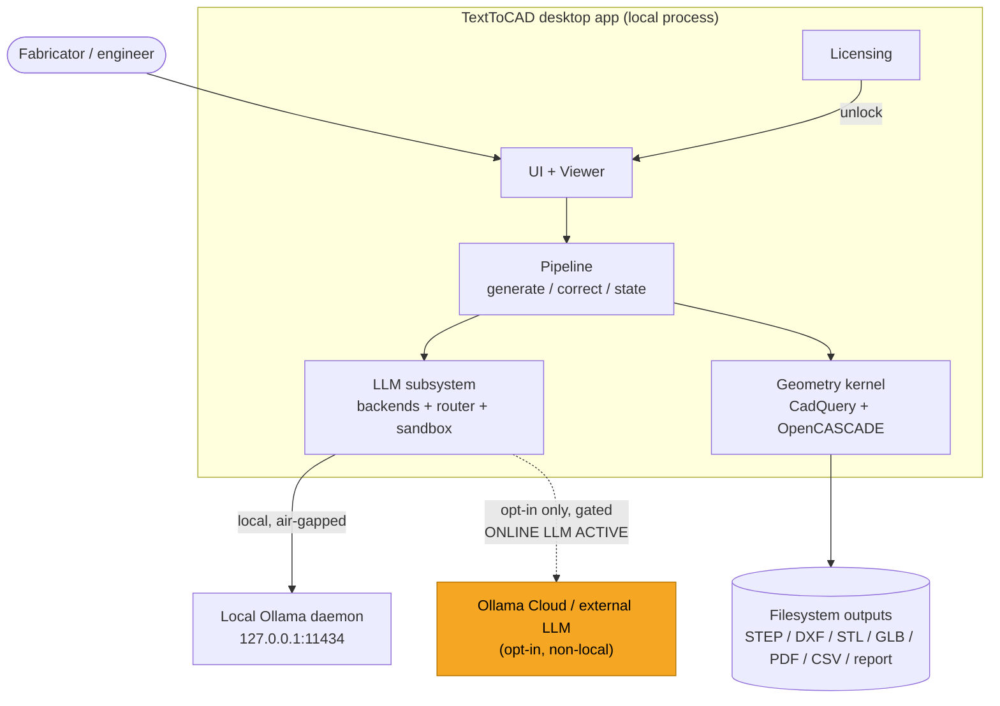
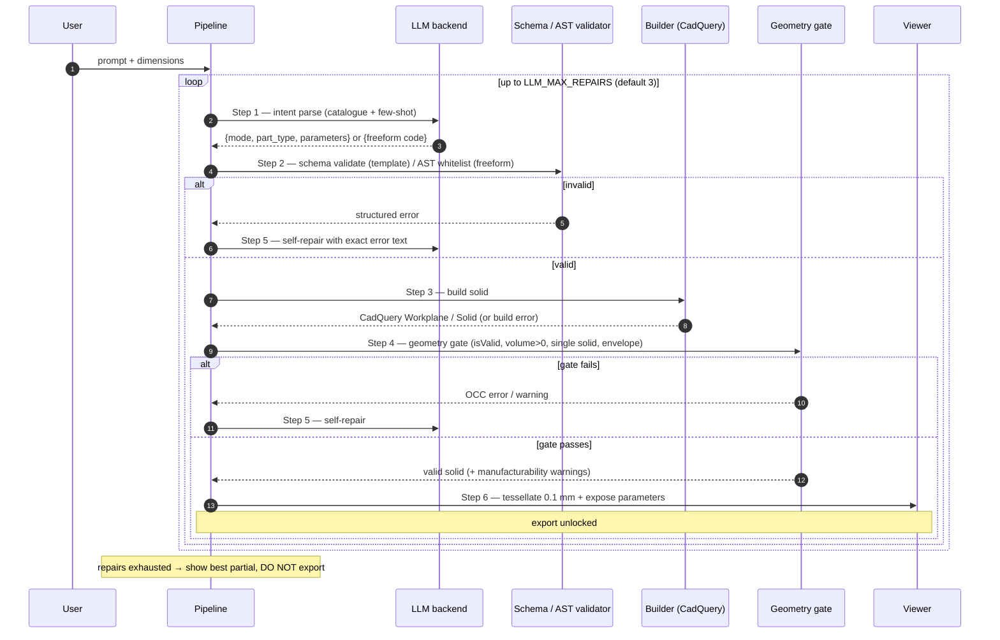
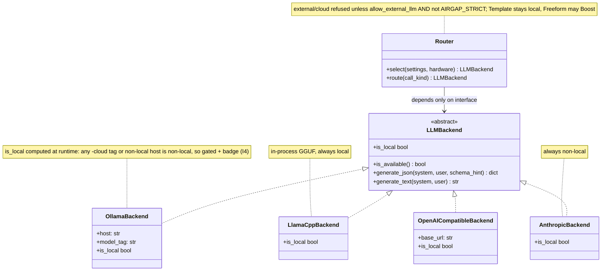
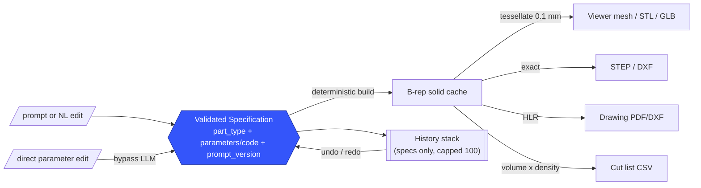
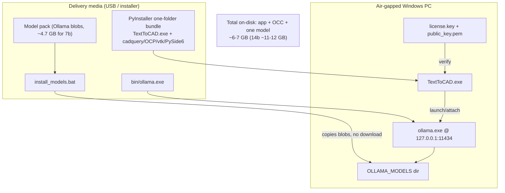

# Architecture — TextToCAD

> Companion to [`docs/SPEC.md`](SPEC.md). Diagrams are Mermaid; they render on GitHub.

## Overview

TextToCAD is a single-process PySide6 desktop app with a strict internal boundary: an
**unreliable LLM front-half** proposes a *specification*, and a **deterministic geometry
back-half** disposes of it into a real B-rep solid. The specification — not any binary — is
the single source of truth (I2). All processing is local by default (I4).

Layers:

- **`ui/`** — PySide6 windows/panels, VTK viewer, and a QThread worker (main thread never blocks).
- **`pipeline/`** — generate → validate → self-repair, the natural-language correction loop, and
  the specification history stack.
- **`llm/`** — the `LLMBackend` interface, four provider adapters, the tier/hybrid router, and the
  security-critical Freeform sandbox.
- **`geometry/`** — pydantic schemas, deterministic builders, the geometry validation gate, and exporters.
- **`licensing/`** — RSA verification, machine hash, clock-rollback guard.
- **`reporting/`** — the per-session conversion report.

---

## 1. System context

The dashed edge to Ollama Cloud is the **only** path allowed to open an external socket, and
only after explicit opt-in; it is impossible in an `AIRGAP_STRICT` build (I4, SPEC 9.5).

---

## 2. Generation pipeline (matches SPEC 3.2 exactly)

---

## 3. LLM backend class diagram (interface + adapters + router)

---

## 4. State / data-flow — the specification is the source of truth (I2)

Everything to the right of the specification is **derived and cached**. Undo/redo, persistence,
and reproducibility operate on specifications; binaries are never stored or diffed.

---

## 5. Deployment view (offline Windows bundle + side-loaded model pack)

The bundle ships no cloud credentials in an `AIRGAP_STRICT` variant; the daemon runs local-only
and the backend refuses any `-cloud` tag (SPEC 9.5).
